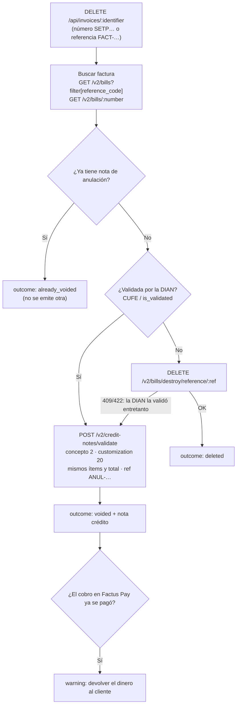

# Factus Voz

> **Factura, cobra y anula hablando.** Una "llamada" con un agente de IA reemplaza el formulario de facturación electrónica: el agente toma los datos de viva voz, emite la factura ante la DIAN a través de **Factus API v2**, abre el cobro en **Factus Pay** y, si hace falta, la **anula legalmente** con una nota crédito.

[](https://nodejs.org/)
[](https://developers.factus.com.co)
[](https://pay-developers.factus.com.co)
[](https://www.dian.gov.co)
[](https://www.dane.gov.co)

---

## Índice

1. [Qué hace y para quién](#1-qué-hace-y-para-quién)
2. [Recorrido de uso](#2-recorrido-de-uso)
3. [Cómo usa las APIs de Factus](#3-cómo-usa-las-apis-de-factus)
4. [Eliminar vs. anular: la regla legal implementada](#4-eliminar-vs-anular-la-regla-legal-implementada)
5. [Rango de numeración automático](#5-rango-de-numeración-automático)
6. [Cobro con Factus Pay](#6-cobro-con-factus-pay)
7. [Arquitectura](#7-arquitectura)
8. [Puesta en marcha](#8-puesta-en-marcha)
9. [Endpoints del backend](#9-endpoints-del-backend)
10. [Interfaz](#10-interfaz)
11. [Alcance y límites](#11-alcance-y-límites)
12. [Documentación adicional](#12-documentación-adicional)

---

## 1. Qué hace y para quién

Emitir una factura electrónica en Colombia exige una veintena de campos codificados (tipo de documento, organización jurídica, código DANE del municipio, tributos, medio de pago, rango de numeración…). **Factus Voz** convierte ese formulario en una conversación:

| Capacidad | Cómo se resuelve |
|---|---|
| **Emitir facturas** | El agente recoge cliente, ítems y pago por voz (o texto) y llama a `POST /v2/bills/validate`. La factura vuelve validada por la DIAN, con número y **CUFE**. |
| **Cobrar** | Cada factura abre un recaudo en `POST /v1/collections` de Factus Pay con la misma referencia; el visor muestra el **QR de pago** cuando Factus Pay lo genera. |
| **Anular facturas validadas** | Una factura con CUFE no se puede borrar: el sistema emite automáticamente la **nota crédito de anulación (concepto DIAN 2)** que la replica línea por línea. |
| **Eliminar facturas sin validar** | Si la DIAN no la validó, se destruye con `DELETE /v2/bills/destroy/reference/:ref`. |
| **Notas crédito parciales** | Devoluciones, descuentos y ajustes de precio (conceptos 1, 3 y 4). |
| **Numeración DIAN** | El rango se resuelve solo consultando `GET /v2/numbering-ranges`. |
| **Códigos DANE** | "Medellín" se traduce a `05001` (DIVIPOLA) sin que nadie memorice códigos. |

**Usuarios:** comercios, profesionales independientes y cajeros que facturan con las manos ocupadas o sin tiempo para formularios. **Evaluadores** pueden probar todo el flujo sin credenciales gracias al modo simulado.

---

## 2. Recorrido de uso

1. **Llamar.** Se toca el botón central; el agente saluda en voz alta (Web Speech API, `es-CO`).
2. **Conversar.** *"Factura para María Gómez, cédula 52123456, en Bogotá, por un diseño de logo de 350 mil, paga por transferencia."* El agente guarda cada dato a medida que lo oye, lee el resumen y pide confirmación.
3. **Recibir.** Aparece en la conversación la ficha de la factura (`SETP990001045 · $416.500 · Validada DIAN`). Al abrirla se ve la hoja con ítems, IVA, CUFE, resolución DIAN y el **cobro de Factus Pay** actualizándose solo hasta mostrar el QR.
4. **Anular.** *"Anula la factura SETP990001045."* El agente confirma y responde: *"Quedó anulada ante la DIAN con la nota crédito NC518."* La factura aparece con sello rojo **ANULADA** y su nota crédito en la pestaña correspondiente.

Todo lo anterior también se puede hacer sin hablar: hay campo de texto en la llamada y el panel **Documentos** permite ver, buscar, anular o eliminar.

---

## 3. Cómo usa las APIs de Factus

| Necesidad | Endpoint de Factus | Dónde vive en el código |
|---|---|---|
| Token OAuth2 (password + refresh) | `POST /oauth/token` | `api/factusAuthClient.js`, política en `services/tokenManager.js` |
| Rangos de numeración | `GET /v2/numbering-ranges?filter[is_active]=1` | `api/factusNumberingRangesClient.js`, `services/numberingRangeService.js` |
| Emitir y validar factura | `POST /v2/bills/validate` | `api/factusBillsClient.js`, `services/invoiceService.js` |
| Listar / buscar por referencia | `GET /v2/bills?filter[reference_code]=…` | idem |
| Detalle de factura | `GET /v2/bills/:number` | idem |
| PDF oficial | `GET /v2/bills/:number/download-pdf` | idem |
| Eliminar factura no validada | `DELETE /v2/bills/destroy/reference/:reference_code` | idem |
| Emitir nota crédito | `POST /v2/credit-notes/validate` | `api/factusCreditNotesClient.js`, `services/creditNoteService.js` |
| Listar notas crédito | `GET /v2/credit-notes` | idem |
| Eliminar nota no validada | `DELETE /v2/credit-notes/reference/:reference_code` | idem |
| Token Factus Pay | `POST /auth` | `api/factusPayAuthClient.js` |
| Abrir cobro | `POST /v1/collections` | `api/factusPayCollectionsClient.js`, `services/collectionService.js` |
| Estado del cobro y QR | `GET /v1/collections/:reference_code` | idem |

**Robustez de la integración:**

- **Un solo cliente HTTP** (`api/httpClientFactory.js`) con timeout y traducción de errores: cualquier fallo de Factus llega como `ApiError` con `source` (`factus.bills`, `factusPay.collections`…) y el **primer mensaje de validación** de Factus/DIAN, para que el usuario oiga *qué* falló y no solo "422".
- **Tokens:** caché con margen de expiración, `refresh_token` antes que login nuevo, una sola petición de token en vuelo aunque lleguen llamadas en paralelo y **reintento transparente ante 401**.
- **Idempotencia:** la referencia de la factura se fija en el borrador *antes* de llamar a Factus; si la red se corta y se reintenta, Factus devuelve la misma factura en vez de emitir otra. La nota de anulación usa la referencia determinística `ANUL-<referencia>`, así que anular dos veces nunca produce dos notas.
- **Normalización:** `services/mappers/factusMapper.js` absorbe las variaciones de forma de Factus (detalle plano o anidado, catálogos como código u objeto, paginación `data.data` o `data`, validación por `is_validated`, `status` o CUFE). El frontend recibe siempre la misma vista.
- **Totales exactos:** IVA y base se redondean por línea, igual que la representación DIAN, para que el monto del pago coincida al centavo con el total de la factura.

---

## 4. Eliminar vs. anular: la regla legal implementada

La DIAN no permite borrar una factura que ya tiene CUFE: hay que **anularla con una nota crédito** (concepto de corrección `2`, *Anulación de factura electrónica*). Como el backend emite siempre con `/v2/bills/validate`, en el sandbox real **toda factura sale validada**: un "eliminar" ingenuo fallaría siempre. `DELETE /api/invoices/:identifier` hace lo correcto:



La nota de anulación se construye a partir del **detalle real de la factura en Factus** (no de lo que recuerde el cliente): mismos ítems, cantidades, precios, tarifas e impuestos, y el mismo total como pago. El cliente se omite a propósito: Factus lo hereda de la factura referenciada, evitando cualquier discrepancia.

Las **notas crédito** siguen la misma ley: una validada no se puede borrar. El backend responde `409` con una explicación y la interfaz ni siquiera ofrece el botón.

---

## 5. Rango de numeración automático

Factus exige `numbering_range_id` en cuanto la cuenta tiene más de un rango activo (lo normal: uno de facturas y otro de notas crédito). `services/numberingRangeService.js` lo resuelve sin intervención humana:

1. Consulta `GET /v2/numbering-ranges?filter[is_active]=1` (recorriendo la paginación).
2. Clasifica cada rango por documento (código `21`/`22` o nombre: *Factura electrónica de venta*, *Nota crédito*; excluye documento soporte, nómina, talonario…).
3. Descarta los no usables: inactivos, vencidos (`is_expired` o `end_date` pasada), eliminados, aún no vigentes o **sin folios libres** (`current > to`).
4. Si quedan varios, elige el de vigencia más larga.
5. Cachea el resultado 5 minutos para no consultar en cada factura; si Factus rechaza una factura con 4xx, la caché se invalida.

Si no hay rango de facturas usable, la emisión se detiene con un mensaje accionable (*"Actívalo o créalo en el panel de Factus"*) en lugar de un error opaco. `FACTUS_BILL_RANGE_ID` y `FACTUS_CREDIT_NOTE_RANGE_ID` permiten fijarlo a mano. El encabezado de la interfaz muestra el rango en uso, los **folios libres** y la vigencia (`GET /api/numbering-ranges`, siempre fresco).

---

## 6. Cobro con Factus Pay

- Cada factura validada abre un recaudo con su misma `reference_code` y el total exacto.
- **El cobro nunca tumba la factura.** Para cuando se cobra, la factura ya existe ante la DIAN; si Factus Pay no está configurado, el monto está fuera de sus límites (**$10.000 – $12.000.000 COP**) o el servicio falla, la respuesta trae `collection.status = disabled | skipped | error` con el motivo, y la interfaz lo muestra.
- Factus Pay genera el QR de forma asíncrona (`started → ready → paid`). El visor consulta `GET /api/invoices/:ref/collection` cada 3 s hasta que el QR existe y lo pinta; si ya se pagó, lo indica.
- Al anular una factura cuyo cobro ya se pagó, la respuesta incluye un aviso para devolver el dinero (Factus Pay no expone un endpoint de reverso).

---

## 7. Arquitectura

```
backend/src/
  api/                  Acceso HTTP puro, un archivo por recurso de Factus / Factus Pay.
    httpClientFactory     Único axios: timeout, Bearer, errores -> ApiError con `source`.
    mock/factusSandbox    Simulador fiel (MOCK_MODE): rangos, 409 al destruir validadas,
                          referencias idempotentes, límites y QR asíncrono de Factus Pay.
  services/             Reglas de negocio. No conocen axios ni URLs.
    invoiceService        Emitir, consultar, eliminar-o-anular, PDF.
    creditNoteService     Notas parciales y de anulación (concepto 2).
    numberingRangeService Elección del rango DIAN.
    collectionService     Cobros Factus Pay sin tumbar la factura.
    documentBuilder       Borrador del agente -> payload exacto de Factus.
    mappers/factusMapper  Respuesta de Factus -> vista estable (funciones puras).
    tokenManager          Política de tokens (caché, refresh, 401, single-flight).
  agent/                Conversación.
    agentService          Claude con tool use; errores de herramientas vuelven al
                          modelo como `is_error` para que los explique.
    fallbackAgent         Asistente guiado sin IA (máquina de estados), mismo set de tools.
    tools                 Puente agente -> services. Sin lógica de Factus.
    textParsing / paymentMapping   "120 mil", "dos", "sí", "tarjeta débito" -> valores.
  controllers/ routes/  Transporte HTTP (Express).
  config/               env, catálogos DIAN, DIVIPOLA DANE.

frontend/src/
  api/backendClient       Único punto de red. El navegador nunca ve tokens ni URLs de Factus.
  features/voiceAgent/    Pantalla de llamada: STT -> agente -> TTS, transcripción y fichas.
  features/documents/     Panel, fichas, visor, cobro Factus Pay, modelo de presentación.
  components/             Layout con estado del sistema, guilloche (sellos y roseta).
```

Las dependencias van en un solo sentido: `routes → controllers → services → api`. El agente consume servicios a través de `tools`, igual que los controladores; por eso la voz y el panel aplican exactamente las mismas reglas. El modo simulado se elige en un único punto por cliente (`env.mockMode ? mock : real`): el resto del sistema no sabe en qué modo está.

---

## 8. Puesta en marcha

Requisitos: Node.js 18+ y Chrome o Edge (reconocimiento de voz).

```bash
# Backend
cd backend
cp .env.example .env
npm install
npm run dev            # http://localhost:4000

# Frontend (otra terminal)
cd frontend
npm install
npm run dev            # http://localhost:5173
```

| Variable | Uso |
|---|---|
| `MOCK_MODE` | `true` (por defecto): simulador local, sin credenciales. `false`: APIs reales (sandbox o producción según las URLs). |
| `FACTUS_BASE_URL`, `FACTUS_CLIENT_ID`, `FACTUS_CLIENT_SECRET`, `FACTUS_USERNAME`, `FACTUS_PASSWORD` | Credenciales OAuth2 de Factus. |
| `FACTUS_BILL_RANGE_ID`, `FACTUS_CREDIT_NOTE_RANGE_ID` | Opcionales. Vacíos = rango automático. |
| `FACTUS_PAY_BASE_URL`, `FACTUS_PAY_EMAIL`, `FACTUS_PAY_PASSWORD` | Opcionales. Sin ellas se emite igual, sin cobro (`collection.status = disabled`). |
| `ANTHROPIC_API_KEY`, `ANTHROPIC_MODEL` | Opcionales. Con clave, conversación libre con Claude; sin ella, asistente guiado. |
| `FRONTEND_ORIGIN` | Orígenes permitidos por CORS (lista separada por comas o `*`). |

**Despliegue:** `vercel.json` publica frontend y backend en el mismo dominio (`/api/*` → backend). El estado de la conversación viaja con cada mensaje, así que funciona en funciones serverless sin memoria compartida.

**Pruebas manuales:** la colección `postman/Factus_API_Voz.postman_collection.json` encadena emitir → consultar → cobro → anular → nota parcial, con tests que verifican CUFE, concepto 2 e idempotencia.

---

## 9. Endpoints del backend

| Método | Ruta | Qué hace |
|---|---|---|
| `GET` | `/api/health` | Modo (simulado/real), motor del agente y si Factus Pay está configurado. |
| `GET` | `/api/numbering-ranges` | Rangos activos y el elegido para facturas y notas crédito. |
| `GET` | `/api/catalogs`, `/api/catalogs/municipalities` | Catálogos DIAN y DANE usados. |
| `GET` | `/api/invoices` | Lista (filtros: `reference_code`, `number`, `identification`, `names`, `prefix`, `status`, `page`). |
| `POST` | `/api/invoices` | Emite factura + cobro. |
| `GET` | `/api/invoices/:identifier` | Detalle por número DIAN o referencia. |
| `GET` | `/api/invoices/:identifier/collection` | Estado del cobro y QR. |
| `GET` | `/api/invoices/:identifier/pdf` | PDF oficial (solo modo real). |
| `DELETE` | `/api/invoices/:identifier` | **Elimina o anula** según la regla de la sección 4. |
| `GET` | `/api/credit-notes` | Lista de notas crédito. |
| `POST` | `/api/credit-notes` | Nota crédito parcial. |
| `DELETE` | `/api/credit-notes/:referenceCode` | Elimina una nota no validada (409 si ya lo está). |
| `POST` | `/api/agent/message` | Turno de conversación. |
| `DELETE` | `/api/agent/session/:sessionId` | Cierra la sesión. |

Esquemas, ejemplos y errores: [`docs/API_REFERENCE.md`](docs/API_REFERENCE.md).

---

## 10. Interfaz

El diseño parte de una idea: **emitir una factura es imprimir un documento de valor**. La interfaz usa la gramática de los billetes y el papel de seguridad (tinta intaglio verde, guilloches, folios en rojo serial) y la sigue con disciplina (ver [`DESIGN.md`](DESIGN.md)):

- **Columna de llamada:** estado gigante (LLAMAR / ESCUCHANDO / PENSANDO / HABLANDO) legible desde el otro lado de la sala, roseta guilloche que reacciona a la voz, transcripción tipo libro contable y campo de texto siempre disponible.
- **Estado del sistema** en el encabezado: motor del agente, modo simulado/real y el **rango DIAN en uso con folios libres y vigencia**.
- **Panel Documentos:** pestañas con conteo, búsqueda por folio/cliente/referencia, fichas con estado fiscal (Validada DIAN, Sin validar, Simulada, **Anulada · NC…**), CUFE y código DANE. Las acciones irreversibles piden confirmación diciendo la consecuencia exacta (*"Se emitirá ante la DIAN una nota crédito de anulación por $416.500. No se puede deshacer."*) y solo se ofrecen cuando son posibles.
- **Visor de factura:** hoja de papel de seguridad con sello guilloche propio, tabla de ítems, totales, CUFE, resolución, **cobro Factus Pay en vivo con QR**, PDF DIAN e impresión; las anuladas llevan un **sello rojo ANULADA** con el número de la nota.
- **Accesibilidad:** foco visible, `aria-live` para estado y avisos, diálogo modal nativo, respeto de `prefers-reduced-motion`, todo operable con teclado.

---

## 11. Alcance y límites

**Incluido:** facturas de venta nacionales en COP a personas naturales o jurídicas, IVA 0/5/19 % o excluido, contado o crédito (vencimiento a 30 días), notas crédito parciales y de anulación, cobro Factus Pay, catálogo DANE de las principales ciudades.

**Fuera de alcance (deliberadamente):**

- Notas débito, documento soporte, nómina electrónica, exportación y moneda extranjera.
- Retenciones, cargos y descuentos globales (`allowance_charges`), anticipos.
- Autenticación de usuarios de la propia app: está pensada para un único comercio; el backend no debe exponerse públicamente sin una capa de acceso.
- Reverso automático de pagos en Factus Pay (la API pública no lo ofrece): se avisa para gestionarlo.
- El catálogo DANE incluido cubre capitales y ciudades principales; una ciudad desconocida **se omite** (Factus lo admite) en vez de inventar un código.

**Verificación:** el flujo completo está probado de punta a punta contra el simulador (emitir, consultar, cobro asíncrono, anular, anular de nuevo, notas parciales, errores 400/404/409, JSON inválido). Los endpoints y formas reales se tomaron de la documentación oficial de Factus y Factus Pay; la capa de mapeo tolera las variaciones de forma conocidas, pero conviene una corrida con credenciales de sandbox antes de producción.

---

## 12. Documentación adicional

- [`docs/API_REFERENCE.md`](docs/API_REFERENCE.md) — contrato del backend, ejemplos y errores.
- [`docs/ARQUITECTURA_Y_EVALUACION.md`](docs/ARQUITECTURA_Y_EVALUACION.md) — decisiones técnicas, diagramas y guion de demo.
- [`docs/STAKEHOLDERS_Y_FLUJOS.md`](docs/STAKEHOLDERS_Y_FLUJOS.md) — actores (DIAN, DANE, comprador), secuencias y estados.
- [`DESIGN.md`](DESIGN.md) y [`PRODUCT.md`](PRODUCT.md) — sistema visual y principios de producto.
