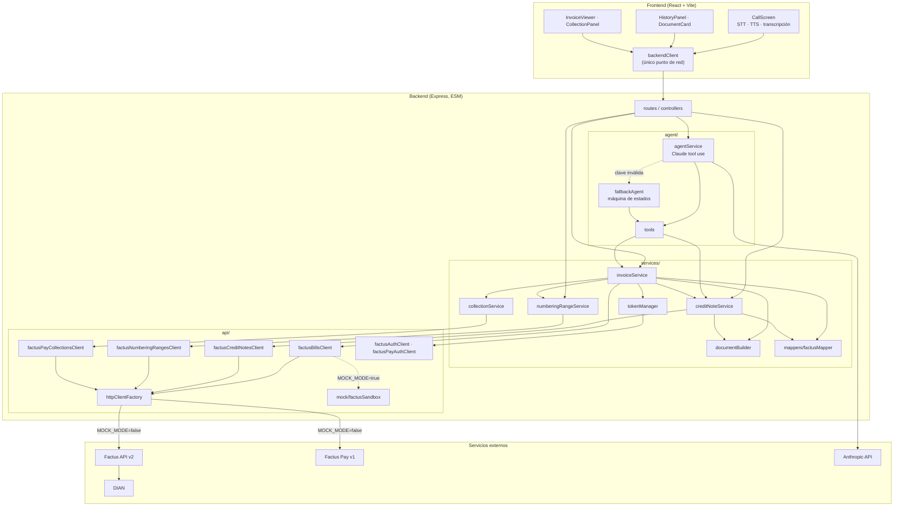

# Factus Voz · Arquitectura y evaluación

Cómo está construido Factus Voz, por qué se tomó cada decisión y cómo responde a cada criterio de evaluación. Para el contrato HTTP ver [`API_REFERENCE.md`](API_REFERENCE.md); para actores y flujos fiscales, [`STAKEHOLDERS_Y_FLUJOS.md`](STAKEHOLDERS_Y_FLUJOS.md).

---

## 1. Criterios de evaluación

### 1.1 Integración de APIs

- **13 operaciones** de Factus v2 y Factus Pay v1 en uso real (no de adorno): OAuth2 password/refresh, rangos de numeración, emitir-validar, listar con filtros, detalle, PDF, destruir, notas crédito (emitir, listar, destruir), login Factus Pay, crear recaudo y consultar recaudo.
- **Encadenamiento con sentido de negocio:** emitir = resolver rango → validar ante la DIAN → abrir cobro; anular = buscar por referencia → detalle → decidir destruir o nota crédito concepto 2 → revisar si el cobro ya se pagó.
- **Resiliencia:** reintento ante 401 con token renovado, *single-flight* de tokens, idempotencia por `reference_code`, timeout uniforme, errores con la regla DIAN que falló, credenciales mal configuradas reportadas con la variable a revisar.
- **Respeto a las reglas de cada API:** límites de monto de Factus Pay, `due_date` obligatoria en ventas a crédito, `customization_id: 20` en notas que referencian factura, rango obligatorio con varios rangos activos.

### 1.2 Funcionamiento

- Ciclo de vida completo por voz y por panel: emitir, consultar, cobrar, anular, eliminar, notas parciales.
- **Nada falla en silencio ni a medias:** si el cobro falla, la factura existe y se dice por qué no hay cobro; si una herramienta del agente falla, el agente lo explica; si la clave de IA es inválida, la llamada continúa con el asistente guiado.
- **Simulador fiel** (`MOCK_MODE`): reproduce el 409 al destruir validadas, la numeración por rangos, las referencias idempotentes y el QR asíncrono, de modo que lo que funciona en demo funciona igual contra Factus.
- Prueba de punta a punta del backend: emitir, cobro `started → ready`, `skipped` por monto bajo, anular, anular de nuevo (`already_voided`), nota parcial, 400/404/409/501 y JSON inválido. Interfaz verificada en navegador: anular desde el panel, flujo de llamada por texto, visor con sello y cobro.

### 1.3 Calidad del código

- **Capas con dependencias en un solo sentido:** `routes → controllers → services → api`. El agente entra por `tools`, igual que un controlador: voz y panel aplican las mismas reglas sin duplicarlas.
- **Alta cohesión:** un servicio por concepto (facturas, notas, rangos, cobros, tokens); un cliente HTTP por recurso de Factus; un único `factusMapper` con funciones puras para toda la variación de formas de respuesta.
- **Bajo acoplamiento:** ningún archivo fuera de `api/` conoce axios ni URLs; el modo simulado se elige en un solo punto por cliente; el frontend solo conoce `backendClient` y vistas normalizadas.
- **Errores tipados** (`ApiError` con `source` y `statusCode`) y un `errorHandler` central que nunca filtra trazas internas al cliente.

### 1.4 Innovación

- **Facturación conversacional real:** el modelo usa herramientas que escriben un borrador estructurado; la IA nunca "recuerda" datos fiscales, los guarda.
- **Anulación legal automática por voz:** *"anula la factura SETP…"* produce la nota crédito correcta, replicando la factura desde Factus.
- **Numeración DIAN sin configuración:** el rango se descubre y se valida (vigencia, folios libres) en cada arranque de caché.
- **Cobro con QR vivo** dentro del documento: la factura y su cobro son una sola pieza.
- **Diseño de "imprenta de seguridad":** la interfaz trata la factura como un documento de valor (sellos guilloche deterministas por CUFE, folios seriales, sello ANULADA).

### 1.5 Presentación y experiencia de usuario

- Estado de la llamada legible desde el otro lado de la sala; estado del sistema (motor, modo, rango y folios libres) siempre visible.
- Confirmaciones que nombran la consecuencia exacta y solo aparecen cuando la acción es posible.
- Búsqueda en el historial, avisos que se retiran solos, carga progresiva del detalle, accesibilidad de teclado y lectores de pantalla.

---

## 2. Diagrama de componentes

---

## 3. Decisiones de diseño

| Decisión | Alternativa descartada | Por qué |
|---|---|---|
| `DELETE /invoices/:id` decide entre destruir y anular | Dos endpoints y que el usuario elija | El usuario no debe conocer el estado DIAN para hacer lo correcto; la ley decide, no el usuario. |
| Nota de anulación construida desde `GET /v2/bills/:number` | Reusar el borrador o datos del cliente | Solo el detalle de Factus garantiza que la nota replica exactamente lo facturado. |
| Referencia `ANUL-<ref>` determinística | Referencia aleatoria | Factus devuelve el documento existente ante una referencia repetida: anular es idempotente sin base de datos propia. |
| Referencia de factura fijada en el borrador antes de emitir | Generarla en cada intento | Un timeout seguido de reintento no duplica la factura. |
| Rango por `GET /v2/numbering-ranges` + caché de 5 min | Pedir el id por variable de entorno | Funciona en cualquier cuenta sin configuración y detecta rangos vencidos o agotados; la variable queda como escape. |
| El cobro nunca tumba la factura | Fallar toda la operación | Para cuando se cobra, el documento ya existe ante la DIAN; un 500 haría creer lo contrario. |
| Mapeador de respuestas puro | Leer campos de Factus en cada componente | Un solo lugar absorbe las variaciones de forma; el frontend no cambia si Factus cambia. |
| Estado de la conversación viaja con cada mensaje | Sesiones en memoria del servidor | Despliegue serverless sin almacenamiento compartido. |
| Errores de herramientas como `tool_result` con `is_error` | Lanzar y cortar la llamada | Claude puede explicarle al usuario qué faltó y seguir la conversación. |
| Ciudad desconocida se omite | Usar Bogotá por defecto | Un código DANE falso en un documento fiscal es peor que omitir un campo opcional. |

---

## 4. Guion de demostración (3 minutos)

**0:00 – 0:30 · El problema.** *"Facturar electrónicamente en Colombia es un formulario de veinte campos con códigos DIAN y DANE. Y si te equivocas, no puedes borrar la factura: la ley exige anularla con una nota crédito. Factus Voz convierte todo eso en una llamada."*

**0:30 – 1:40 · Emitir por voz.**
1. Señalar el encabezado: modo, motor y **rango DIAN con folios libres**, leído en vivo de `GET /v2/numbering-ranges`.
2. Llamar y decir: *"Factura para María Gómez, cédula 52123456, en Bogotá, un diseño de logo de 350 mil, paga por transferencia."*
3. El agente lee el resumen; responder *"sí"*. Aparece la ficha **SETP… · $416.500 · Validada DIAN**.
4. Abrirla: CUFE, resolución, código DANE `11001` y el **cobro de Factus Pay** pasando de "generando" a listo.

**1:40 – 2:30 · Anular por voz.**
1. Decir: *"Anula la factura SETP…"*. El agente confirma la consecuencia.
2. Responder *"sí"*: *"Quedó anulada ante la DIAN con la nota crédito NC…"*. La ficha muestra el sello rojo **ANULADA** y la nota aparece en su pestaña con concepto *Anulación de factura*.
3. Mencionar: repetir la orden no genera otra nota (idempotencia), y una nota validada ni siquiera ofrece "eliminar".

**2:30 – 3:00 · Cierre técnico.** *"Trece operaciones de Factus y Factus Pay encadenadas con reglas reales: rango automático, anulación legal, cobro que nunca tumba la factura y una arquitectura donde la voz y el panel comparten exactamente la misma lógica."*
